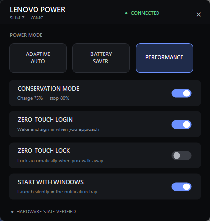

<p align="center">
  
</p>

<h1 align="center">Lenovo Quick Settings</h1>

<p align="center">
  A small, borderless Windows tray app for quick access to the Lenovo hardware settings on a Lenovo Slim 7 14ILL10 (83MC).
</p>

<p align="center">
  
</p>

The app calls the same installed Lenovo controller agents used by Vantage and verifies each change by reading the hardware state back. It does not substitute Windows power-overlay settings or write guessed registry values.

## Controls

- Adaptive power mode (Auto)
- Battery saver
- Performance
- Conservation mode (start charging at 75%, stop at 80%)
- Zero-touch login (wake and use Windows Hello when you approach)
- Zero-touch lock (lock automatically when you walk away)
- Optional silent notification-tray startup with Windows

The panel never creates a taskbar button. Closing or minimizing it hides it in the notification tray; left-click the tray icon to reopen the panel, or right-click it for direct controls.

## Download

Download **[LenovoQuickSettings.exe](https://github.com/jspann21/lenovo-quick-settings/releases/latest/download/LenovoQuickSettings.exe)** from the [latest release](https://github.com/jspann21/lenovo-quick-settings/releases/latest).

The executable is a personal, unsigned Windows utility, so Windows may display a SmartScreen warning after downloading it.

### Development builds

1. Open the repository's **Actions** tab.
2. Select **Build Windows executable**.
3. Open a successful workflow run.
4. Download the **LenovoQuickSettings-windows-x64** artifact.
5. Extract `LenovoQuickSettings.exe` from the downloaded ZIP.

## Changelog

### v1.1.0

- Keep the panel and tray responsive while Lenovo hardware requests run in the background, with Refresh recovery when controls are unavailable.
- Improve diagnostic reports and verification cleanup, including restoration of the original Quick charging mode.
- Harden installation and removal, and publish a versioned Windows EXE automatically with each release.

### v1.0.0

- Initial release with tray controls for power, conservation charging, presence detection, and Windows startup.

## Build locally

Run:

```powershell
.\LenovoQuickSettings\build.ps1
```

The build uses the .NET Framework C# compiler included with Windows and writes:

```text
LenovoQuickSettings\dist\LenovoQuickSettings.exe
```

No Lenovo binaries are copied into the repository or bundled into the executable. Lenovo's installed Vantage add-ins are discovered at runtime.

The version in `LenovoQuickSettings/app.manifest` is also embedded in the EXE's file and product metadata. To publish a release, update that version and the changelog above, then push a matching `vMAJOR.MINOR.PATCH` tag. GitHub Actions verifies the version, builds the EXE, and publishes it with the matching changelog entry on the [releases page](https://github.com/jspann21/lenovo-quick-settings/releases).

Hardware requests run serially on a background STA thread so the panel and tray remain responsive. If Lenovo controls are unavailable, use **Refresh** in the tray menu to retry; Windows startup settings remain accessible. Failed changes are read back before hardware controls are re-enabled.

## Diagnostics

To write a hardware status report without changing settings:

```powershell
Start-Process .\LenovoQuickSettings\dist\LenovoQuickSettings.exe -ArgumentList '--status-file "C:\Temp\lenovo-status.txt"' -Wait
```

The output directory must already exist. Relative report paths are resolved against the launching process's working directory before Lenovo's agents load. An invalid output path returns exit code 1 before contacting the hardware.

The optional `--verification-cycle "C:\Temp\lenovo-cycle.txt"` command temporarily changes power and conservation settings, then attempts to restore the original power mode and exact charging mode, including Quick charging. Each setting it attempted to change is restored independently. Check the report and exit code: a failed restoration can leave a setting changed, and verification, restoration, or controller cleanup failures return exit code 1.

## Install

After building, run:

```powershell
.\LenovoQuickSettings\install.ps1
```

This installs the executable under `%LOCALAPPDATA%\LenovoQuickSettings`, enables silent tray startup, and creates Desktop and Start-menu shortcuts. Use `-NoStartup` to install without enabling startup, or `-NoLaunch` to avoid launching immediately.

To remove the installed app, shortcuts, and startup entry:

```powershell
.\LenovoQuickSettings\uninstall.ps1
```

## Hardware mapping

| UI control | Lenovo controller value |
|---|---|
| Adaptive power mode | `ItsAuto` |
| Battery saver | `MmcCool` |
| Performance | `MmcPerformance` |
| Conservation enabled | battery charge mode `Storage` |
| Conservation disabled | battery charge mode `Normal` |
| Zero-touch login | human-presence `ApproachEnabled` |
| Zero-touch lock | human-presence `PresenceLeaveEnabled` |

## Requirements and scope

This project intentionally targets one computer rather than providing broad Lenovo model compatibility. It expects Lenovo Vantage's `IdeaNotebookAddin` and `SmartInteractAddin` under `%PROGRAMDATA%\Lenovo\Vantage\Addins` and discovers the newest complete version of each add-in at startup.

The GitHub-hosted runner can compile the executable, but it cannot run hardware integration tests because Lenovo's drivers and add-ins are not present there.
